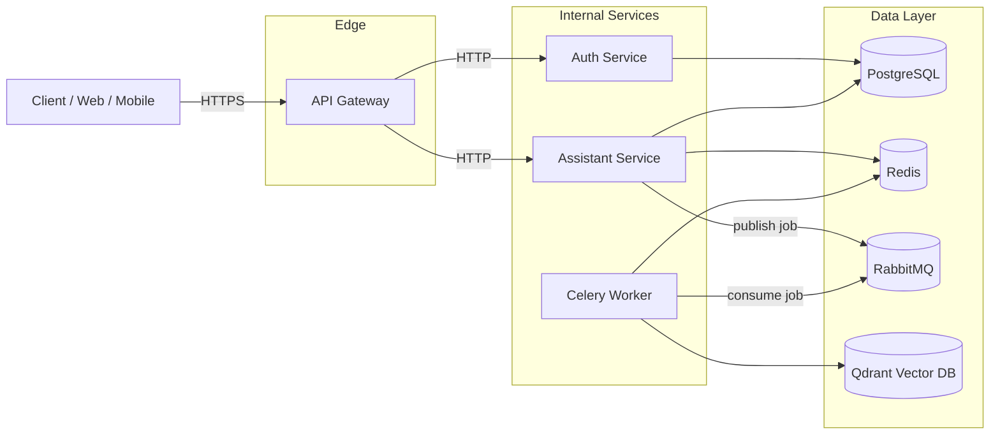
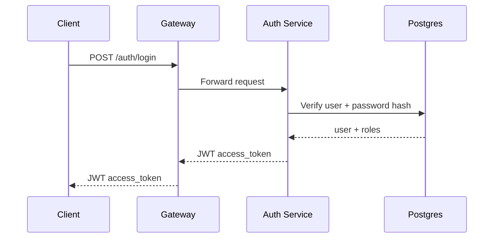
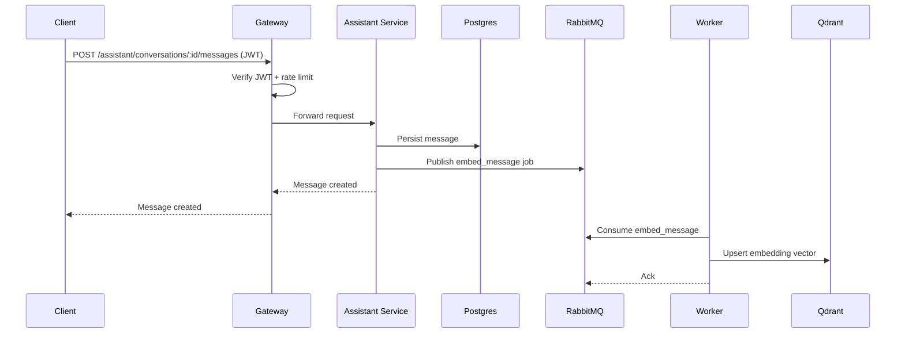
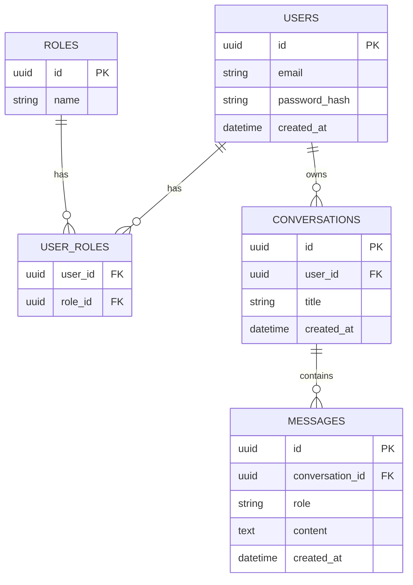

# AI Business Assistant — System Design (Foundation)

## 1) Goals

- Provide a production-ready foundation for an end-to-end AI business assistant.
- Prefer **loosely-coupled microservices** connected via HTTP and async jobs.
- Support core platform needs: **auth/RBAC, async processing, caching, embeddings storage, observability, and secure config**.

## 2) High-level microservices architecture

**Services in this repository (skeleton):**

- **API Gateway** (`ai_business_assistant.gateway`)
  - External entry point
  - Rate limiting and request correlation IDs
  - JWT enforcement before forwarding traffic to internal services
- **Auth Service** (`ai_business_assistant.auth_service`)
  - User registration/login
  - JWT issuance
  - RBAC role management foundation
- **Assistant Service** (`ai_business_assistant.assistant_service`)
  - Conversation/message APIs
  - Persists structured data in Postgres
  - Enqueues background jobs (e.g., embeddings)
- **Worker** (`ai_business_assistant.worker`)
  - Celery workers for long-running/background tasks
  - Example task: `embed_message` storing embeddings in Qdrant

**Data infrastructure:**

- **PostgreSQL** (structured data)
- **Redis** (caching + task results)
- **RabbitMQ** (Celery broker)
- **Vector DB: Qdrant** (embeddings)

### Component diagram

## 3) Data flow diagrams

### Login (JWT issuance)

### Send message + async embeddings

## 4) Database schema (foundation)

Structured data is in Postgres using async SQLAlchemy models.

### ER diagram

## 5) Async processing (Celery/RabbitMQ)

- **RabbitMQ** is the broker.
- **Redis** stores results (and can also be used for caching).
- Celery tasks live in `ai_business_assistant/worker/tasks.py`.

## 6) Configuration management

- All services use a shared `Settings` object (`ai_business_assistant/shared/config.py`).
- Configuration is via environment variables (optionally loaded from `.env`).
- A sample environment file is provided as `.env.example`.

Recommended next steps for production:

- Use a secret manager (AWS Secrets Manager, Vault, GCP Secret Manager).
- Rotate JWT secrets and database credentials.

## 7) Logging, monitoring, observability

Implemented foundation:

- JSON logging via `ai_business_assistant/shared/logging.py`.
- Request correlation IDs via `RequestIdMiddleware` (`X-Request-Id`).
- Prometheus metrics via `/metrics` on each service.
- Docker Compose includes Prometheus + Grafana.

Recommended next steps:

- OpenTelemetry tracing (OTLP exporter) for distributed traces.
- Central log aggregation (Loki/ELK).

## 8) Security foundation

- JWT authentication with access tokens.
- RBAC primitive: `roles` on JWT and DB.
- Rate limiting at the gateway.

Encryption at rest / transit:

- **Transit:** terminate TLS at the edge (gateway or external load balancer).
- **At rest:** use disk encryption (cloud-managed), Postgres encryption features where applicable, and encrypt application secrets (e.g., tool/API keys) before persisting.

## 9) API gateway

In this foundation the **gateway** is a FastAPI service that:

- Enforces rate limits
- Verifies JWT on protected routes
- Proxies traffic to internal services

This can be replaced with dedicated gateways (Kong/Envoy/Traefik) later without changing internal services.

## 10) Local development

See `docs/dev-setup.md` for end-to-end local setup using Docker Compose.
